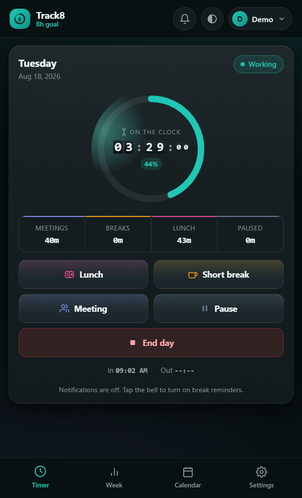
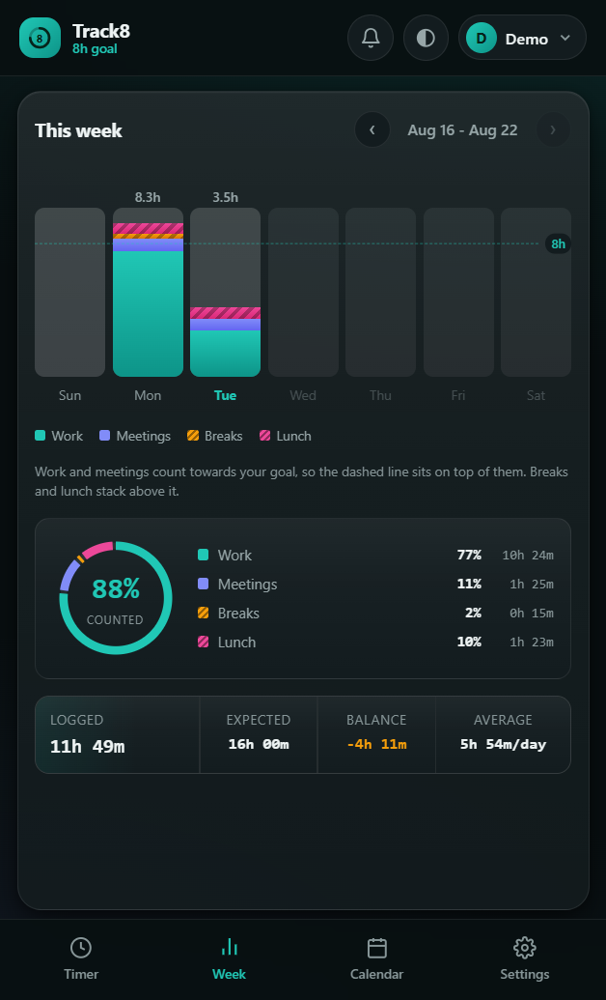

# ⏱️ Track8

> **How much of your 8 hours have you actually worked today?**
> One number, on your phone, correct even when the app has been closed all afternoon.

[](#-install-it-on-your-phone)
[](#-project-structure)
[](#-project-structure)
[](#-your-data)
[](#-deploy-it)

Start work, join a meeting, take a break, take lunch, end the day. ☕ Meetings count towards your 8 hours; breaks and lunch do not. Forget to come back from a break and the app chases you until you clock back in.

Sign in with your email and a 6-digit code — no password, no sign-up form. Your hours then live both on the device and on your own server, so a new phone or a cleared browser gets them back.

**The app never waits for the network.** Every tap is written locally and returns immediately; sync happens quietly in the background and is skipped entirely when there is nothing to sync to. Offline it behaves exactly as it does online.

---

## 📸 Screenshots

<p align="center">
  
  &nbsp;&nbsp;
  
</p>

<p align="center"><sub>Timer · Week. There is also a month calendar, a per-day breakdown with the full timeline, and a settings screen whose collapsed headers quote their own values.</sub></p>

---

## ✨ What it does

| | |
|---|---|
| 🎯 **One target** | A circular ring against your daily goal, live percentage, and a flip-clock readout of counted time. |
| 👥 **Meetings count, breaks don't** | Meetings are tracked separately so you can see how much of the week went to calls rather than to your own work. |
| 🔔 **Reminders that survive a locked phone** | Four layers, from a server push down to a catch-up the moment you reopen the app. |
| 📌 **A pinned notification** | Start a break from the shade without unlocking the phone. The worker handles the tap even with the app closed. |
| 🌙 **Nothing invented, ever** | A shift you forgot to end stops accruing at 10 pm instead of reporting 30 hours. |
| ✏️ **Every day is correctable** | Wrong start time, an accidental pause, a break you never logged — fix any of it, including today. |
| 📅 **Week and month views** | Stacked bars with a goal line, a colour-coded calendar, and a running balance against your target. |
| 📊 **Real `.xlsx` export** | Three sheets with real dates and real numbers — sort, filter and pivot without cleaning anything up. |
| 👤 **Multiple profiles** | Several people on one device, each with their own history. |
| 🔐 **Email-code accounts** | Optional. Sync across devices, with row-level security behind every query. |
| 📴 **Offline first** | Installable PWA, full offline shell, zero external requests — no CDN fonts, no analytics, no icons from a URL. |

---

## 📲 Install it on your phone

Reminders only work properly once the app is on your home screen. In a browser tab, the phone treats it as a page it may freeze at any moment.

- **Android (Chrome)** — open the site → ⋮ menu → **Install app**. Open Track8 from the new icon from then on.
- **iPhone (Safari)** — open the site → Share → **Add to Home Screen**. Notifications need iOS 16.4+ *and* the home-screen install; Safari tabs cannot show them at all.

Then open the app, tap the 🔔 in the top bar, and allow notifications.

<details>
<summary><b>⚠️ One more step on Android — battery savers</b></summary>

<br>

Phone makers stack their own battery savers on top of Android, and those silence the app while the screen is off. Find your browser (or Track8, if it was installed as its own app) in:

| Phone | Where to go |
|---|---|
| **Samsung** | Settings › Battery › Background usage limits → not in *Sleeping apps*, set to **Unrestricted** |
| **Xiaomi / Redmi / POCO** | Settings › Apps › Manage apps › Track8 › Battery saver → **No restrictions**, and turn **Autostart** on |
| **OnePlus / Oppo / Realme / vivo** | Settings › Battery › Battery optimisation › Track8 → **Don't optimise** |
| **Pixel / Motorola / stock** | Settings › Apps › Track8 › Battery → **Unrestricted** |

Skip this and you still get the pinned notification and a reminder the moment you open the app — you only lose the nudges while the phone is asleep.

</details>

---

## 🔔 How the reminders work

You asked for: start a break, put the phone away, and be told at 15 minutes and every 5 after that if you forget to come back. Lunch the same, from 30 minutes.

Nothing running inside a phone browser can be trusted to wake a sleeping phone, so this is delivered in layers. The weakest one failing never costs you the reminder entirely.

| Layer | What it is | Reliability |
|---|---|---|
| **0️⃣ Server push** | Your deadline is held server-side and the reminder is sent to the phone at the right moment. Nothing of the app's has to still be running, so no battery manager can interfere. | ✅ Solves the problem — needs the server deployed |
| **1️⃣ Pinned notification** | Appears the moment a break starts and stays in the shade for the whole break, stating the time you are due back and carrying **End break**. | ✅ Always |
| **2️⃣ Live nudges** | At 15 minutes, then every 5, with sound and vibration. Needs the timer to survive the screen going off, which Android only allows for pages playing audio — so a silent track plays for the length of the break. | ⚠️ Usually on Android, never on iOS |
| **3️⃣ Catch-up** | Whenever you open the app it derives the true elapsed time from timestamps and tells you at once: *"You have been on break for 34 minutes."* | ✅ Cannot fail |

The app notices when your phone kills layer 2 and **says so**, rather than letting a late reminder look like an unreliable app.

### ☕ Breaks straight from the notification

On Android you never have to open the app to take a break or come back from one. The tap is handled in the background — no window appears, nothing to unlock.

| What the shade shows | What it offers |
|---|---|
| ⏱️ On the clock | **☕ Break** |
| 👥 In a meeting | **☕ Break** |
| ☕ Break · back by 14:35 | **End break** |
| 🍱 Lunch · back by 13:15 | **End lunch** |
| ⏸️ Paused | **▶ Back on the clock** |

**Why only one button?** Android sizes each notification action to its own label and packs them from the left — there is no width, gap or alignment control, and `Notification.maxActions` is **2**. Two adjacent chips got mis-hit on a real phone (the tap meant for Break landed on Lunch), and padded, differently-sized labels did not fix it. One button has the row to itself. Lunch, pause, ending the day and logging a meeting open the app on purpose — starting the wrong kind of rest without noticing is worse than unlocking the phone.

**Your hours stay exact even though the app was closed.** The tap is recorded with the moment it happened and filed into your day when you next open Track8. A break ended at 14:32 is a break that ended at 14:32, whether the app caught up at 14:33 or at six in the evening.

> **iOS caveat** — iPhones ignore notification buttons entirely. Tapping the notification opens the app and you clock back in from there.

---

## 🧮 Why the numbers stay right

Time is stored as a list of moments, not as a running count:

```
09:02  started work
11:00  meeting
11:40  back to work
12:31  lunch
13:14  back to work
18:05  ended day
```

Totals are derived by **subtracting timestamps** whenever you look. Nothing has to be awake and counting — so your hours survive the phone locking, the tab closing, the browser throttling background timers, and the laptop being suspended for a week. Counter-based versions silently lost every minute the page was not running.

It is also what makes a notification tap safe to file hours late, and what makes any day correctable after the fact.

### 🌙 Forgot to end the day?

A day **stops accruing at 10 pm**. A shift left running last Tuesday reports Tuesday's hours up to 22:00 — not the 30 or 42 hours since, which would poison the week bars, the calendar and the balance.

The clock-out is stamped *at 10 pm*, not at the moment the app finds out, so the total is the same whether you open the app at 22:01 or the following Friday. Because 10 pm is a guess, the day is flagged and the recovery banner keeps asking until you either correct the hours or tap **Looks right**.

Still genuinely working at 22:30? Then it is a late shift, not a forgotten one: the day runs to midnight, and if the app is open when midnight passes it closes the day there and carries your state into the new one.

---

## ✏️ Correcting a day

Open any day from the calendar or the week view → **Correct this day**.

| Field | Behaviour |
|---|---|
| 🕘 **Started at** | The real clock-in. |
| 🕕 **Finished at** | The real clock-out — or tick **Still on the clock** and it *is* now. |
| 💻 **Desk work** | **Derived, never typed by hand.** It is whatever is left of the shift once meetings, breaks, lunch and pauses come off. Move the start an hour earlier and it grows by an hour. |
| 👥 **Meetings** · ☕ **Break** · 🍱 **Lunch** · ⏸️ **Paused** | Minutes each. Change any of them and desk work follows. Tapped Pause by accident? Set it to `0` and the time returns to your desk hours. |

**Correcting today does not clock you out.** *Still on the clock* is ticked automatically for a day that is still running: the finish is now, desk work is read-only because it is fully determined, and the timer picks straight back up after you save. If you are genuinely on your lunch while correcting an unrelated field, the day stays on lunch — the correction does not end it.

On a closed day the form works the other way too: type a desk-work figure and the **finish time** moves instead, so the two directions never fight over the same number.

---

## 🎨 Colour means the same thing everywhere

The status pill, the ring, the week bars, the calendar and the day timeline all agree:

| | | Counted? |
|---|---|---|
| 🟢 Green | Work | ✅ |
| 🔵 Blue | Meetings | ✅ |
| 🟠 Amber | Short breaks | ❌ |
| 🟣 Violet | Lunch | ❌ |
| ⚫ Slate | Paused | ❌ |

Colour is never the only channel: counted time is solid, uncounted time is hatched, so the answer survives red–green colour blindness. `--text-muted` is measured against its surface (5.8:1 today), never guessed.

---

## 📊 Getting your hours out

**Settings › Export to Excel** downloads a real `.xlsx` with three sheets:

- **Daily log** — one row per day: date, clock in/out, work, meetings, counted total, target, balance, breaks, lunch, status, note. The sheet you would send to someone.
- **Timeline** — one row per activity span. The audit trail behind the daily log.
- **Monthly summary** — days worked, hours, expected, balance, average per day.

Dates are real dates and hours are real numbers. Headers are frozen and filters are already on.

> ⚠️ **Settings › Backup file** writes a `.json` instead. That is the boring one and the important one: **it is the only file that can be restored.** The spreadsheet is for reading and sharing; it cannot be read back in.

---

## 🔐 Accounts and sync

Signing in is an email address and a 6-digit code. No password to forget, no sign-up step — an address becomes an account the first time it proves it can receive a code.

- 🏷️ **Your name is a label, never a credential.** It fills in your profile, and only when that profile has no name yet.
- ⬆️ **Already been using the app?** Everything on the device is uploaded the first time you sign in. Nothing starts fresh.
- ✉️ **Changing your email** sends the code to the *new* address — that is the thing being proved; your session proves the rest.
- 📴 **Offline** is unchanged. Days are written locally and returned immediately; sync catches up later. Where two devices edited the same day offline, the newer edit wins and the older is kept rather than thrown away.
- 🛡️ **What is on the server:** day event logs, profile names, settings. Each account can only read its own — enforced by every query being scoped to the signed-in account *and*, behind that, by Postgres row-level security, so a query that forgot its filter returns nothing rather than everything.

---

## 💾 Your data

The working copy lives in this browser's local storage under `track8_attendance_app_v2`; the durable copy lives in your database once you are signed in.

Signed out, or deployed without a server, it is **local only** — clearing your browser data deletes it, and hours logged on your phone will not appear on your laptop. Take a backup now and then.

Data from the earlier version migrates automatically on first open. Those days are marked *imported*, because the original kept only totals — their timeline is a reconstruction.

---

## 🚀 Deploy it

The client is plain HTML, CSS and JavaScript. **No build step, no bundler, no framework, no dependencies.**

### Option A — static host

Copy the folder to GitHub Pages or any static host. You get the tracker, offline support and the on-device reminder layers. No accounts, no sync, no server-sent reminders — the app detects their absence and quietly runs local-only.

> **HTTPS is required.** Service workers and notifications are disabled on plain HTTP and on `file://`, and without HTTPS Android offers a bookmark shortcut rather than a real install.

### Option B — with the server

`server/` is a small Express app that serves the site *and* runs sync and push. Same origin on purpose: a push subscription belongs to the origin that registered the service worker. `render.yaml` describes the deployment.

1. **Neon** → create a Postgres project, copy the *pooled* connection string.
2. **Brevo** → verify a sender address, create an API key. HTTP API, not SMTP — Render blocks ports 25, 465 and 587.
3. `cd server && npm install && npm run keys` once, for the VAPID key pair.
4. Set `DATABASE_URL`, `BREVO_API_KEY`, `MAIL_FROM_EMAIL`, `MAIL_FROM_NAME`, `VAPID_PUBLIC_KEY`, `VAPID_PRIVATE_KEY`, `VAPID_SUBJECT` in Render's Environment tab.
5. **Point a cron at `/healthz` every 10 minutes.** Free-tier Render idles after ~15 minutes, and an idle server cannot send a reminder on time.

`/healthz` reports which parts are live: `{"sync":true,"mail":true,"push":true}`. See [`server/README.md`](server/README.md) for every failure mode and what the app does in each.

### 🖥️ Run it locally

```bash
# everything, including sync and sign-in
cd server && npm install && npm start        # http://localhost:3000

# tracker only — offline, on-device reminders, no accounts
python -m http.server 8123                   # http://127.0.0.1:8123/
```

Copy `server/.env.example` to `server/.env` first. Leave `BREVO_API_KEY` empty and the sign-in code is printed to the server console instead of emailed — enough to work on the whole flow without sending mail.

`127.0.0.1` counts as a secure origin. Opening `index.html` directly does **not** — service workers and notifications are disabled on `file://`.

<details>
<summary><b>🔄 After you publish an update</b></summary>

<br>

The app may need one extra refresh to pick it up. On Android, an installed Track8 that is only backgrounded can keep running the **old service worker**, so a notification may still show yesterday's buttons after the app itself has refreshed. Swipe Track8 fully out of recents, reopen it, and start and end one break to redraw the pinned card.

Android's **Clear cache** is safe if it is still stuck. **Clear data / Clear storage** is not — that erases your hours. Take a backup first.

</details>

---

## 🗂️ Project structure

```
index.html               markup, modals, sign-in screen
styles.css               design system, mobile-first, safe-area aware
manifest.webmanifest     home-screen install metadata
sw.js                    offline cache, notification delivery, push handler,
                         and break/lunch settled without opening the app
icons/                   generated app icons
render.yaml              deployment blueprint

js/timeline.js           event log → durations. Pure: no DOM, no storage
js/store.js              the persisted shape, validation, v1 → v2 migration
js/xlsx.js               .xlsx writer: store-only ZIP + CRC32 + SpreadsheetML
js/report.js             the three worksheets, built from the event logs
js/handoff.js            the IndexedDB box the page and the worker share
js/shift-card.js         what the pinned notification says and offers
js/notify.js             the on-device reminder layers
js/push.js               subscribes this device to server-sent reminders
js/sync.js               account, sign-in, background delta sync
js/ui.js                 all DOM rendering — nothing else writes to the DOM
js/app.js                state machine, tick loop, event handlers

server/index.js          serves the app, routes the API
server/db.js             schema, pool, per-account transactions
server/auth.js           emailed codes, sessions, changing your address
server/sync.js           the one delta-exchange endpoint
server/reminders.js      pending reminders and the send scheduler
server/mail.js           Brevo HTTP API
```

**Read [`js/timeline.js`](js/timeline.js) first** — everything else depends on it being right. [`server/db.js`](server/db.js) is second, because everything about keeping one person's hours away from another's is decided there.

Working on this with an AI assistant? [`CLAUDE.md`](CLAUDE.md) carries the invariants, the platform limits and the bugs that have already been paid for once.

---

## 🤝 Contributing

The rules that are easy to break, in short:

- ❌ **Never accumulate a duration on a tick.** Subtract timestamps. Everything correct about this app follows from that one rule.
- ❌ **No build step in `js/`** — no npm, no TypeScript, no bundler, no runtime library. The folder must stay deployable to a plain static host. `server/` is exempt.
- ❌ **No external requests, ever.** No CDN fonts, no analytics, no icons from a URL.
- ❌ **Never `new Date('2026-08-13')`** — that parses as UTC and shifts the day west of Greenwich. Use `TL.dateFromKey()`.
- ✅ **Bump `VERSION` in `sw.js`** whenever `js/handoff.js` or `js/shift-card.js` changes — the worker pulls them in through version-stamped `importScripts`, and an edit without a bump leaves phones drawing notifications from the old copy.
- ✅ **Verify in a real browser.** There is no test runner; `window.T8Timeline`, `window.T8Store`, `window.T8Report` and `window.T8Sync` are exposed for exactly that.
